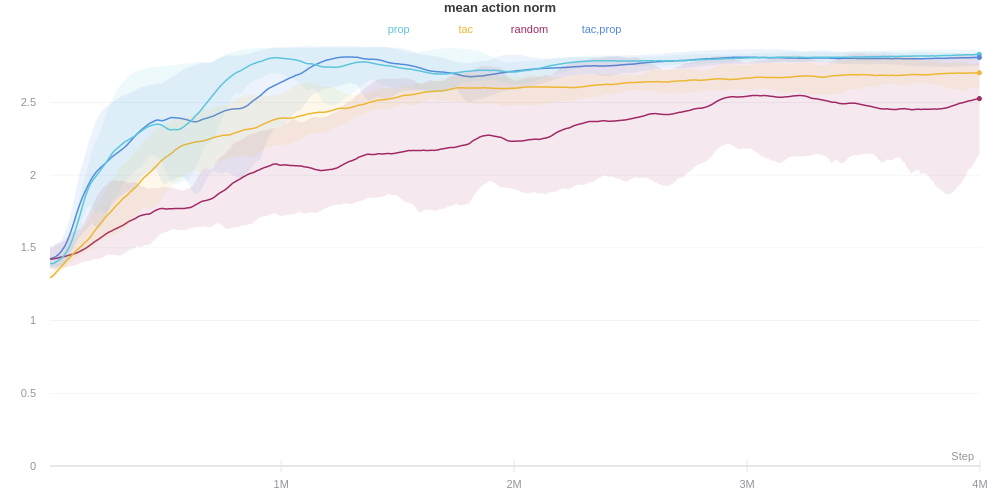

# Recap of Results

## Agent Interactions

Here the interactions of the agent are classified into three types. Self collision (agent touching his own body), external collision (agent touches table) and dynamic collision (agent touches mobiles). They are measured as rate of collision i.e. the number of collisions divided by the amount of simulation steps.

## Range of Motion

# Possible Extension

## Goal Based Approach

### Idea

Use a goal-based policy of the form $\pi(s, g)$ instead of $\pi(s)$. If the goals are provided in state space, i.e. $\mathbb{S} = \mathbb{G}$, then the reward for the agent can simply be $R_i = \| s_i - g \|^2$. Since the reward function is stationary in this case, it can be learned by an off-policy algorithm efficiently as in @Schaul. A second mechanism is required in order to pick the goals from a goal buffer.

### Pros

- easy to interpret as a range of skills since each goal has a associated skill i.e. goal conditioned policy
- off-policy makes will cut back in time require
- reward is dense and stationary

### Cons

- it's not obvious how the stream of rewards from the forward model predictions could be integrated
- since the agent controlling the joints learns a goal-conditioned policy, it can't make use of the curiosity signal
  - one could think of an approach where a goal conditioned policy is learned and the goal associated reward functions are also non-stationary. Here, the goals would not be defined in state space but rather as abstract symbols, associated with different reward functions. Possible reward functions could be other formulations of intrinsic curiosity i.e. loss of the inverse model, learning progress, prediction on the prediction error and many more. This sounds like a very hard problem though and should, if at all, be verified in a simpler setup first.
- curiosity therefore has to come from the higher-level agent i.e. the goal picking agent
- the curiosity signal does not drive low level motor commands and therefore gives no insight about how intrinsic motivations are used to help facilitate the formation of motor commands

## Extrinsic Phase

### Idea

After training the agent in the intrinsic phase, use an extrinsic phase in order to assess the knowledge the agent has accumulated while using only intrinsic motivation.

### Pros

- Verify that the agent has acquires skills during training
- pretty easy to do since it's natural to compare to agent with no training
- meaningful interpretation regarding the role of intrinsic curiosity in skill learning
- in theory an off-policy algorithm could be used for training an agent (somehow also a con)

### Cons

- using only the forward model approach seems like it's not going to benefit the algorithm
- training might take even longer when an intrinsic phase is followed by an extrinsic phase

## Inverse Model as Source of Reward

### Idea

As an intrinsic reward use the prediction error of the inverse model. This should make the agent prefer states where given two consecutive states, the related action is hard to infer.

### Pros

- very easy to implement
- very easy to analyse in terms of the analysis which I'm already doing
- might yield different behaviour compared to the forward model

### Cons

- interpretation not quite clear
- very near to what is already being done

