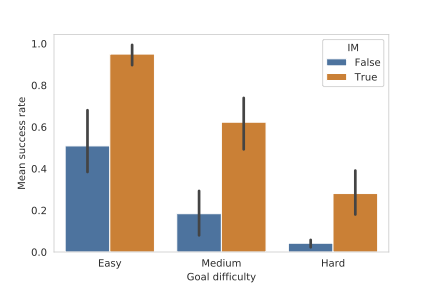

# Master's thesis: Using Models in Intrinsically Motivated Reinforcement Learning
This repositoy contains the code for the [master's thesis](https://drive.google.com/file/d/1z-CzYXX3lF-L5jk5ozgvnYQmdprxqU0R/view?usp=sharing) on intrinsically motivated learning in robotics conducted at the [Frankfurt Institute for Advanced Studies](https://fias.institute/en/) under supervision of [Jochen Triesch](https://www.fias.science/en/neuroscience/research-groups/jochen-triesch/) and Charles Wilmot.

## Summary
The goal of this thesis was to investigate how intrinsic motivation can be used to benefit the control of highly complex 7-DOF robot arms. 

We first conducted a detailed analysis how reinforcement learnign agents (PPO) without any extrinsic rewards discover and manipulate their environment. We found that exploration which uses intrinsic motivation computed from multiple modalities (proprioception **and** touch) is much more efficient than using either proprioception or touch in isolation. We thus advocate that all possible sensor streams should be factored in when trying to model human-like exploration schema.

The second part of the thesis develops a novel reinforcement learning algorithm that uses a learned inverse model of the environment to reach goals in sparse reward settings. We find that this approach is order of magnitude more effective than using random exploration to reach goals. Furthermore, our approach is suited for on-policy learning methods and fulfills a similar role as hindsight experience replay (HER) does in off-policy settings.
We also show that when learning the inverse model from data which was generated by intrinsically motivated agents, we can reach goals even faster and more efficient.

Especially in settings where goals are harder to reach (further form the starting point), intrinsic motivation makes the biggest impact on performance.
